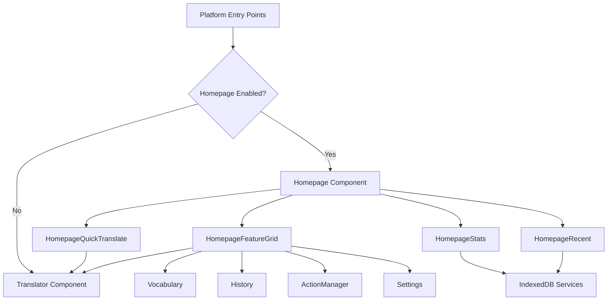

# Add Homepage - Product Requirements Document

## Executive Summary

### Problem Statement
NextAI Translator currently launches users directly into the translation interface without a central navigation hub. Users must navigate through settings icons or know specific pathways to access features like vocabulary, history, action management, and settings. This fragmented experience makes it harder for users to discover and utilize the full capabilities of the application.

### Proposed Solution
Introduce a homepage as the central entry point that provides:
- Quick access to core features (Translation, Vocabulary, History, Actions, Settings)
- Overview of recent activity and statistics
- Streamlined navigation across all platform targets (browser extension, desktop app)

### Expected Impact
- **Improved Feature Discovery**: Users will more easily find and use advanced features like vocabulary collection and custom actions
- **Enhanced User Engagement**: Statistics and recent activity encourage continued usage
- **Better Onboarding**: New users can understand application capabilities at a glance
- **Consistent Cross-Platform Experience**: Unified entry point across all platforms

### Success Metrics
- Increase in feature utilization (vocabulary, custom actions) by 25%
- Reduction in support queries about "how to find X feature" by 30%
- User satisfaction improvement measured via in-app feedback

## Requirements & Scope

### Functional Requirements

| ID | Requirement | Priority |
|----|-------------|----------|
| REQ-1 | Homepage displays quick-access cards/tiles for core features: Translate, Vocabulary, History, Actions, Settings | Must |
| REQ-2 | Homepage shows summary statistics: total translations, words collected, recent activity count | Should |
| REQ-3 | Homepage provides quick-translate input field for immediate translation without navigation | Must |
| REQ-4 | Homepage displays recent translations (last 5) with one-click access to full history | Should |
| REQ-5 | Homepage adapts layout responsively for popup (compact), options page (standard), and desktop (full) views | Must |
| REQ-6 | Homepage respects current theme settings (light/dark/system) | Must |
| REQ-7 | Homepage is accessible via keyboard navigation and screen readers | Should |
| REQ-8 | Users can configure homepage as default landing page or skip directly to translator | Could |

### Non-Functional Requirements

| ID | Requirement | Priority |
|----|-------------|----------|
| NFR-1 | Homepage loads within 200ms on typical hardware | Must |
| NFR-2 | Homepage uses existing BaseUI component library for consistency | Must |
| NFR-3 | Homepage component is reusable across all platform targets | Must |
| NFR-4 | Statistics data fetching does not block initial render | Should |
| NFR-5 | Homepage maintains accessibility standards (WCAG 2.1 AA) | Should |

### Out of Scope
- User accounts or cloud sync functionality
- Onboarding wizard or tutorial system
- Dashboard customization or widget arrangement
- Analytics dashboard for detailed usage patterns
- Social features or sharing capabilities

### Success Criteria
- Homepage component renders correctly on all three platforms (extension popup, extension options, desktop)
- All navigation links function correctly and route to appropriate views
- Theme switching applies correctly to homepage
- Statistics load and display accurately from IndexedDB
- Performance budget of 200ms initial render is met

## User Stories

### Personas
- **Language Learner**: Uses vocabulary collection and wants to review collected words
- **Power User**: Frequently uses custom actions and wants quick access to all features
- **Casual User**: Primarily translates text and wants the simplest path to translation

### Core User Stories

**US-1: Quick Feature Access**
- As a power user, I want to see all available features on one page, so that I can quickly navigate to any feature I need.
- **Priority**: Must
- **Related Requirements**: REQ-1
- **Acceptance Criteria**:
  - Given I open the application
  - When the homepage loads
  - Then I see clearly labeled cards/tiles for Translate, Vocabulary, History, Actions, and Settings
  - And clicking any card navigates me to that feature

**US-2: View Activity Summary**
- As a language learner, I want to see my translation statistics at a glance, so that I can track my learning progress.
- **Priority**: Should
- **Related Requirements**: REQ-2
- **Acceptance Criteria**:
  - Given I am on the homepage
  - When statistics are loaded
  - Then I see total translations count, words collected count, and recent activity summary
  - And the statistics reflect my actual usage data

**US-3: Quick Translation**
- As a casual user, I want to translate text directly from the homepage, so that I don't have to navigate to a separate page for simple translations.
- **Priority**: Must
- **Related Requirements**: REQ-3
- **Acceptance Criteria**:
  - Given I am on the homepage
  - When I enter text in the quick-translate field and submit
  - Then I see the translation result without leaving the homepage context
  - Or I am navigated to the full translator with my text pre-filled

**US-4: Resume Recent Work**
- As a returning user, I want to see my recent translations, so that I can quickly continue where I left off.
- **Priority**: Should
- **Related Requirements**: REQ-4
- **Acceptance Criteria**:
  - Given I have previous translations in my history
  - When I view the homepage
  - Then I see up to 5 recent translations with source and target text preview
  - And clicking a recent translation opens it in the translator

**US-5: Responsive Experience**
- As a browser extension user, I want the homepage to fit well in the popup, so that I can use it effectively in the compact popup window.
- **Priority**: Must
- **Related Requirements**: REQ-5
- **Acceptance Criteria**:
  - Given I open the extension popup
  - When the homepage renders
  - Then the layout is compact and scrollable within popup dimensions
  - And all essential features remain accessible

**US-6: Consistent Theming**
- As a user with dark mode enabled, I want the homepage to respect my theme preference, so that the experience is visually consistent.
- **Priority**: Must
- **Related Requirements**: REQ-6
- **Acceptance Criteria**:
  - Given I have set my theme preference to dark mode
  - When I view the homepage
  - Then all homepage elements render with dark theme colors
  - And theme changes apply immediately without page refresh

**US-7: Optional Homepage**
- As a power user who primarily translates, I want to skip the homepage and go directly to the translator, so that I can save time on my most common task.
- **Priority**: Could
- **Related Requirements**: REQ-8
- **Acceptance Criteria**:
  - Given I access the settings
  - When I configure "Start Page" preference
  - Then I can choose between Homepage or Translator as my default landing page
  - And the application respects this preference on subsequent launches

## User Experience & Interface

### User Journey
1. **Launch**: User opens extension popup, options page, or desktop application
2. **Homepage View**: User sees homepage with feature cards, quick-translate, and recent activity
3. **Navigation**: User clicks desired feature card or uses quick-translate
4. **Feature Usage**: User completes their task in the selected feature view
5. **Return**: User returns to homepage via back button or home icon for next action

### Interface Requirements

#### Layout Structure (Desktop/Options Page)
```
+------------------------------------------+
|  [Logo]  NextAI Translator     [Theme]   |
+------------------------------------------+
|  Quick Translate                         |
|  [________________] [Translate]          |
+------------------------------------------+
|  +--------+  +--------+  +--------+      |
|  |Translate| |Vocabulary| |History|      |
|  |   icon  | |  icon   | | icon  |      |
|  +--------+  +--------+  +--------+      |
|  +--------+  +--------+                  |
|  |Actions | |Settings |                  |
|  |  icon  | |  icon   |                  |
|  +--------+  +--------+                  |
+------------------------------------------+
|  Recent Translations                     |
|  - "Hello" -> "Bonjour" (2 min ago)     |
|  - "Thank you" -> "Merci" (1 hr ago)    |
|  [View All History]                      |
+------------------------------------------+
|  Stats: 150 translations | 45 words     |
+------------------------------------------+
```

#### Layout Structure (Popup - Compact)
```
+------------------------+
| [Logo] NextAI    [Gear]|
+------------------------+
| [Quick translate...]   |
+------------------------+
| [Trans] [Vocab] [Hist] |
| [Acts]  [Sets]         |
+------------------------+
| Recent: "Hello"->...   |
+------------------------+
```

### Accessibility Considerations
- All feature cards have descriptive aria-labels
- Keyboard navigation follows logical tab order
- Focus states are clearly visible
- Statistics have appropriate ARIA live regions for screen readers
- Color contrast meets WCAG 2.1 AA standards

## Technical Considerations

### High-Level Approach
Create a new `Homepage` component in `src/common/components/` that:
- Uses existing BaseUI components for consistent styling
- Fetches statistics from IndexedDB via existing Dexie services
- Integrates with existing routing/navigation patterns per platform
- Supports responsive breakpoints for different viewport sizes

### Integration Points
- **IndexedDB Services**: `historyService`, `vocabularyService`, `actionService` for statistics
- **Settings Store**: For theme and homepage preference settings
- **Navigation**: Platform-specific navigation (window management in Tauri, routes in extension)
- **Common Components**: Reuse `Settings`, `Vocabulary`, `TranslationHistory`, `ActionManager`, `Translator`

### Key Technical Constraints
- Must work within browser extension popup size constraints (~400x600px)
- Must not increase initial bundle size significantly (code-split if needed)
- Statistics queries must be non-blocking to maintain render performance
- Must maintain compatibility with all existing platform polyfills

### Performance Considerations
- Lazy load statistics after initial render
- Use SWR for cached data fetching with stale-while-revalidate pattern
- Consider virtualization if recent translations list grows
- Minimize re-renders with proper memoization

## Design Specification

### Recommended Approach
Implement homepage as a new shared React component (`Homepage.tsx`) in `src/common/components/` that integrates with existing platform entry points, using BaseUI's Card and Grid components for consistent layout.

### Key Technical Decisions

#### 1. Component Architecture
- **Options Considered**: Single monolithic component vs. composable sub-components
- **Tradeoffs**: Monolithic is simpler but harder to customize per platform; composable allows platform-specific layouts but adds complexity
- **Recommendation**: Composable sub-components (HomepageStats, HomepageQuickTranslate, HomepageFeatureGrid, HomepageRecent) wrapped by a layout-aware parent component for maximum reusability.

#### 2. Navigation Pattern
- **Options Considered**: Replace current entry points vs. add as new route/window vs. conditional rendering based on settings
- **Tradeoffs**: Replacement changes user expectations; new route adds complexity; conditional rendering is flexible but adds logic
- **Recommendation**: Conditional rendering based on user setting, with homepage as default, allowing users to opt-out and go directly to translator.

#### 3. Statistics Data Loading
- **Options Considered**: Eager load on mount vs. lazy load after render vs. background sync
- **Tradeoffs**: Eager blocks render; lazy shows loading states; background sync requires service worker complexity
- **Recommendation**: Lazy load with SWR after initial render, showing skeleton placeholders for statistics while loading.

#### 4. Responsive Layout Strategy
- **Options Considered**: CSS-only responsive vs. JavaScript viewport detection vs. platform-specific components
- **Tradeoffs**: CSS-only is cleanest but limited; JS detection allows logic changes; platform-specific duplicates code
- **Recommendation**: CSS-based responsive design using BaseUI's responsive utilities, with minor JS detection for popup vs. full-page distinctions.

### High-Level Architecture


### Key Considerations
- **Performance**: Initial render under 200ms by deferring statistics loading; use React.memo and useMemo for feature cards
- **Security**: No new external data sources; all data from local IndexedDB; no new permissions required
- **Scalability**: Component architecture supports adding new feature cards without structural changes

### Risk Management
- **Platform Inconsistency Risk**: Different platforms may have subtle navigation differences; mitigate by thorough cross-platform testing and abstracted navigation hooks
- **Performance Regression Risk**: Adding new entry point component could slow launch; mitigate by code-splitting and lazy loading non-critical sections

### Success Criteria
- Homepage renders in under 200ms on all platforms
- All feature navigation works correctly across browser extension and desktop
- Statistics load without blocking user interaction
- Theme switching applies correctly without layout shifts

## Dependencies & Assumptions

### Dependencies
- Existing BaseUI component library and Styletron styling engine
- IndexedDB services (`historyService`, `vocabularyService`, `actionService`)
- Settings store and theme system
- Platform-specific entry points (popup/index.tsx, options/index.tsx, Tauri windows)

### Assumptions
- Users prefer a centralized navigation hub over direct feature access
- Statistics from IndexedDB can be queried efficiently without performance impact
- Existing component architecture can accommodate a new homepage without major refactoring
- Browser extension popup dimensions (typically 400x600px) are sufficient for compact homepage layout

## Appendices

### Reference: Existing Windows (Tauri Desktop)
From `src/tauri/App.tsx`:
- translator
- action_manager
- settings
- thumb
- updater
- screenshot
- history

### Reference: Existing Feature Components
From `src/common/components/`:
- Translator.tsx - Main translation interface
- Settings.tsx - Configuration panel
- ActionManager.tsx - Custom actions management
- Vocabulary.tsx - Word collection interface
- TranslationHistory.tsx - History viewer
