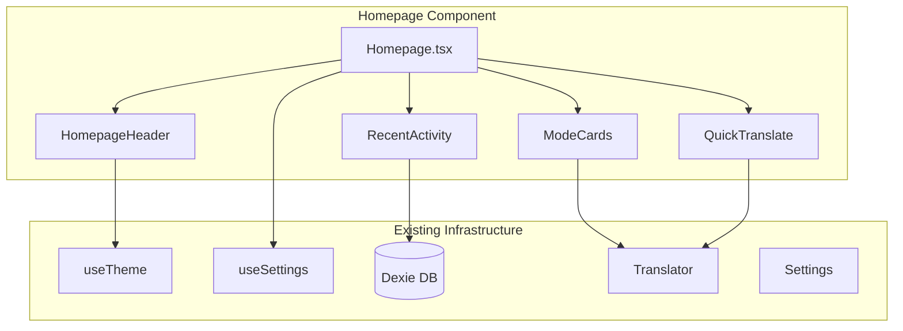

# Homepage Enhancement Initiative - Product Requirements Document

## Executive Summary

### Problem Statement
NextAI Translator currently lacks a dedicated homepage or landing experience. Users are immediately presented with functional interfaces (Translator in browser popup, Settings in options page, or specific windows in desktop app) without an introductory entry point that showcases the application's capabilities, provides navigation, or offers a welcoming user experience.

### Proposed Solution
Introduce a homepage component that serves as a central navigation hub and landing experience for NextAI Translator. This homepage will provide users with quick access to core features, display recent activity, showcase available translation modes, and offer an intuitive entry point to the application's functionality.

### Expected Impact
- **Improved User Experience**: New users will have a clear understanding of available features and how to access them
- **Better Feature Discoverability**: Users will be exposed to features they may not have known existed (e.g., polishing, summarization, code explanation)
- **Increased Engagement**: Quick access to recent translations and vocabulary will encourage continued usage
- **Cohesive Brand Experience**: A polished landing page reinforces the product's professional identity

### Success Metrics
- User engagement with homepage navigation elements (click-through rates)
- Reduction in time-to-first-translation for new users
- Feature discovery rate (users accessing features beyond basic translation)
- User satisfaction scores related to navigation and onboarding

---

## Requirements & Scope

### Functional Requirements

| ID | Requirement | Priority |
|----|-------------|----------|
| REQ-1 | Homepage shall display a welcome section with the NextAI Translator branding and tagline | Must |
| REQ-2 | Homepage shall provide quick-access navigation to core features: Translation, Settings, Vocabulary, History | Must |
| REQ-3 | Homepage shall display recent translations (last 3-5 items) with ability to re-open them | Should |
| REQ-4 | Homepage shall showcase available translation modes (translate, polish, summarize, analyze, explain-code) | Must |
| REQ-5 | Homepage shall include a quick-translate input field for immediate use | Should |
| REQ-6 | Homepage shall display the currently configured AI provider status | Could |
| REQ-7 | Homepage shall support both light and dark themes consistent with existing theming system | Must |
| REQ-8 | Homepage shall be accessible on all supported platforms (browser extension popup, options page, desktop app) | Must |
| REQ-9 | Homepage shall be responsive and adapt to different window sizes | Must |
| REQ-10 | Homepage shall provide first-time user onboarding hints or tips | Could |

### Non-Functional Requirements

| ID | Requirement | Priority |
|----|-------------|----------|
| NFR-1 | Homepage shall load within 500ms on standard hardware | Must |
| NFR-2 | Homepage shall follow existing BaseUI and Styletron styling patterns | Must |
| NFR-3 | Homepage shall be accessible (WCAG 2.1 Level AA compliance) | Should |
| NFR-4 | Homepage shall maintain consistent styling with existing application components | Must |
| NFR-5 | Homepage code shall be placed in `src/common/components/` for cross-platform reuse | Must |

### Out of Scope
- User authentication or account management features
- Cloud sync functionality for homepage preferences
- Social sharing or collaboration features
- Analytics dashboard or detailed usage statistics
- Multi-language homepage content (will use existing i18n system)

### Success Criteria
- Homepage renders correctly on all three platforms (browser extension, desktop, userscript)
- All navigation elements route to correct destinations
- Theme switching works seamlessly on homepage
- No regression in existing application functionality
- Page load performance meets NFR-1 requirement

---

## User Stories

### Personas
1. **New User**: First-time visitor unfamiliar with the application's capabilities
2. **Regular User**: Frequent user who wants quick access to translation and recent activity
3. **Power User**: Advanced user who utilizes multiple translation modes and features

### Core Stories

| Story | Priority | Related Requirements |
|-------|----------|---------------------|
| US-1: As a **new user**, I want to see a welcoming homepage that explains what the application does, so that I understand its value proposition | Must | REQ-1, REQ-4 |
| US-2: As a **regular user**, I want quick access to my recent translations from the homepage, so that I can continue my work efficiently | Should | REQ-3 |
| US-3: As a **regular user**, I want to navigate directly to core features from the homepage, so that I can quickly access what I need | Must | REQ-2 |
| US-4: As a **power user**, I want to see all available translation modes on the homepage, so that I can choose the right mode for my task | Must | REQ-4 |
| US-5: As a **user**, I want the homepage to respect my theme preference, so that I have a consistent visual experience | Must | REQ-7 |

### Acceptance Criteria

**US-1: Welcome Experience**
```gherkin
Given I am a new user opening the application
When the homepage loads
Then I should see the NextAI Translator logo and branding
And I should see a tagline describing the application purpose
And I should see visual indicators of available features
```

**US-2: Recent Translations**
```gherkin
Given I have previous translation history
When I view the homepage
Then I should see up to 5 recent translations
And each translation should show source text preview and target language
When I click on a recent translation
Then I should be navigated to the translator with that content loaded
```

**US-3: Feature Navigation**
```gherkin
Given I am on the homepage
When I click on the "Translate" navigation item
Then I should be navigated to the Translator component
When I click on the "Settings" navigation item
Then I should be navigated to the Settings component
When I click on the "Vocabulary" navigation item
Then I should be navigated to the Vocabulary component
When I click on the "History" navigation item
Then I should be navigated to the History component
```

**US-4: Translation Modes Display**
```gherkin
Given I am on the homepage
When I view the translation modes section
Then I should see cards or icons for: Translate, Polish, Summarize, Analyze, Explain Code
And each mode should have a brief description
When I click on a mode
Then I should be navigated to the translator with that mode pre-selected
```

**US-5: Theme Consistency**
```gherkin
Given my application theme is set to "dark"
When I view the homepage
Then the homepage should render with dark theme colors
And all text should be readable against the background
When I change my theme to "light"
Then the homepage should immediately reflect the light theme
```

---

## User Experience & Interface

### User Journey

```
┌─────────────┐    ┌─────────────┐    ┌─────────────────────┐
│  App Opens  │───▶│  Homepage   │───▶│  Feature Selected   │
└─────────────┘    └─────────────┘    └─────────────────────┘
                         │
                         ├── Quick Translate ──▶ Translation Result
                         ├── Recent Item ──────▶ Translator (loaded)
                         ├── Mode Card ────────▶ Translator (mode set)
                         ├── Navigation ───────▶ Settings/Vocab/History
                         └── Settings Icon ────▶ Settings
```

### Interface Requirements

**Layout Structure**:
1. **Header**: Logo, tagline, settings icon
2. **Quick Actions**: Translation modes as interactive cards
3. **Quick Translate**: Compact input field with translate button
4. **Recent Activity**: List of recent translations (collapsible)
5. **Navigation Footer**: Links to Vocabulary, History, Settings

**Responsive Behavior**:
- **Browser Popup (400x600px)**: Compact vertical layout, condensed cards
- **Options Page (768px max)**: Full layout with all sections visible
- **Desktop Window**: Flexible layout adapting to window size

### Accessibility Considerations
- All interactive elements must be keyboard navigable
- Screen reader announcements for navigation changes
- Sufficient color contrast ratios (4.5:1 for text)
- Focus indicators on all interactive elements

---

## Technical Considerations

### High-Level Technical Approach
The homepage will be implemented as a new React component (`Homepage.tsx`) in `src/common/components/`, following the existing component patterns. It will utilize the established BaseUI component library and Styletron for styling, ensuring consistency with the current design system.

### Integration Points
- **State Management**: Use existing `useSettings` hook for theme and preferences
- **Data Access**: Use existing Dexie hooks for translation history and vocabulary counts
- **Navigation**: Integrate with existing platform-specific routing (extension tabs, Tauri windows)
- **Theming**: Leverage existing `useTheme` hook and `IThemedStyleProps` pattern

### Key Technical Constraints
- Must work within browser extension popup size constraints (~400x600px)
- Must not significantly increase bundle size
- Must maintain compatibility with all three build targets (chromium, firefox, tauri)
- Must use existing dependencies only (no new UI libraries)

### Performance Considerations
- Lazy load recent translations data
- Use existing SWR caching for data fetching
- Minimize component re-renders with proper memoization

---

## Design Specification

### Recommended Approach
Create a modular Homepage component that uses composition to adapt to different platform contexts. The component will query existing data sources (history, settings) and provide navigation through platform-appropriate mechanisms.

### Key Technical Decisions

#### 1. Component Architecture
- **Options Considered**: Single monolithic component vs. Composable sub-components
- **Tradeoffs**: Monolithic is simpler but less flexible; composable allows platform-specific variations but adds complexity
- **Recommendation**: Composable sub-components (HomepageHeader, ModeCards, RecentActivity, QuickTranslate) - enables platform-specific layouts while maintaining shared logic

#### 2. Navigation Strategy
- **Options Considered**: URL-based routing vs. Component state vs. Platform-native navigation
- **Tradeoffs**: URL routing requires router setup; component state is simple but loses history; platform-native respects each target's patterns
- **Recommendation**: Platform-native navigation - use browser extension tab management for extensions and Tauri window management for desktop, matching existing patterns

#### 3. Data Loading Approach
- **Options Considered**: Eager loading vs. Lazy loading vs. Skeleton loading
- **Tradeoffs**: Eager may delay initial render; lazy may show empty states; skeleton provides perceived performance
- **Recommendation**: Skeleton loading with SWR - shows immediate UI structure while data loads, consistent with existing SWR usage

### High-Level Architecture



### Key Considerations
- **Performance**: Component should render initial UI in <100ms; data loading via SWR provides caching and background revalidation
- **Security**: No new security concerns; uses existing data access patterns with local storage only
- **Scalability**: Composable architecture allows adding new sections without major refactoring

### Risk Management
- **Platform Inconsistency Risk**: Different platforms may render differently; mitigate with thorough cross-platform testing and responsive design patterns
- **Data Availability Risk**: History may be empty for new users; mitigate with graceful empty states and onboarding hints

### Success Criteria
- Homepage component loads within 500ms on all platforms
- All navigation flows work correctly on browser extension, options page, and desktop
- Component passes accessibility audit (keyboard navigation, screen reader compatibility)
- No increase in bundle size >20KB

---

## Dependencies & Assumptions

### Dependencies
- Existing BaseUI component library and theme system
- Existing Dexie database schema for history and vocabulary
- Existing SWR hooks and data fetching patterns
- Existing i18n infrastructure for internationalization

### Assumptions
- The homepage will replace or precede the current direct-to-translator flow
- Users will have option to bypass homepage for power-user workflows
- Existing translation history data structure is sufficient for homepage display
- No backend changes required; all data is client-side

### Cross-Team Coordination
- None required; this is a frontend-only change using existing infrastructure

---

## Appendices

### Reference: Existing Component Patterns
- **Translator.tsx**: Main translation interface, will be navigation target from homepage
- **Settings.tsx**: Configuration interface, uses same theming patterns
- **TranslationHistory.tsx**: Existing history component, can be referenced for data display patterns

### Reference: Platform Entry Points
- Browser Extension Popup: `src/browser-extension/popup/index.tsx`
- Browser Extension Options: `src/browser-extension/options/index.tsx`
- Desktop App: `src/tauri/App.tsx` with window-based routing

### Reference: Available Translation Modes
1. **Translate**: Standard translation between 55+ languages
2. **Polish**: Improves clarity, conciseness, and coherence
3. **Summarize**: Condenses text into concise summaries
4. **Analyze**: Translation with grammar explanation
5. **Explain Code**: Code explanation with bug detection
