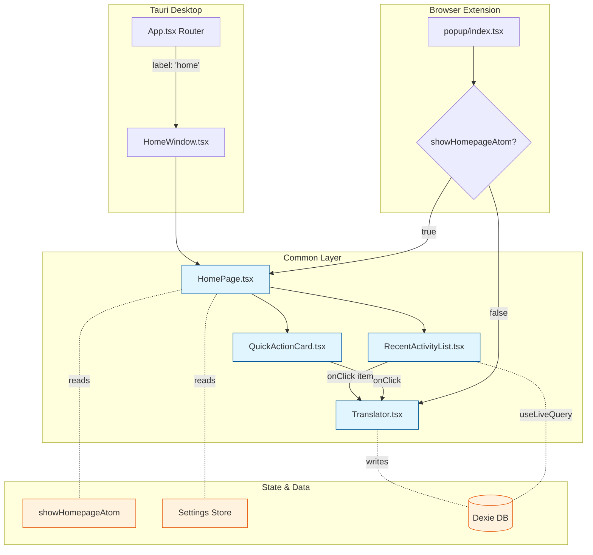

# Design Specification: Homepage Landing Interface

## Overview
nextai translator currently lacks a centralized entry point, directing users immediately to the translation interface. This creates confusion for new users and limits feature discoverability. We need a homepage that serves as a welcoming landing interface with quick access to core features (translate, polish, summarize), recent activity, and navigation to settings.

## Recommended Approach
Implement a shared homepage component in `src/common/components/HomePage.tsx` that provides:
1. Quick action cards for translate/polish/summarize
2. Optional recent translation history display
3. Navigation to settings and vocabulary
4. Platform-specific integration through existing window/popup routing

The homepage will be opt-in initially via user preference, with keyboard shortcuts to bypass it for power users.

## Key Technical Decisions

### 1. Component Architecture
- **Options Considered**: Single monolithic HomePage vs. composed smaller components vs. extending existing Translator component
- **Tradeoffs**:
  - Monolithic: Simpler initial implementation but harder to maintain; all logic in one file
  - Composed: Better separation of concerns, reusable parts, but more files to manage
  - Extending Translator: Minimal code changes but adds complexity to already large (117KB) component
- **Recommendation**: **Composed components** - Create `HomePage.tsx` as orchestrator with `QuickActionCard.tsx` and `RecentActivityList.tsx` as reusable sub-components. This aligns with existing architecture (see Translator.tsx importing multiple sub-components) and enables code reuse.

### 2. State Management
- **Options Considered**: Jotai atoms vs. Zustand store vs. Component useState vs. SWR for recent activity
- **Tradeoffs**:
  - Jotai: Best for derived state and atomic updates; minimal boilerplate
  - Zustand: Better for global app state like user preferences; already used for settings
  - useState: Simplest but only local to component; not sharable
  - SWR: Overkill since data is local; designed for remote fetching
- **Recommendation**: **Hybrid approach**
  - Use Jotai atom for `showHomepageAtom` (similar to existing `showSettingsAtom` pattern in src/common/store/setting.ts)
  - Use Zustand for homepage preferences (default landing page, show/hide recent activity) integrated into existing settings store
  - Use Dexie + useLiveQuery for recent activity (consistent with Vocabulary.tsx pattern)

### 3. Recent Activity Storage
- **Options Considered**: New Dexie table vs. extend existing translation history vs. localStorage/chrome.storage only
- **Tradeoffs**:
  - New Dexie table: Structured, queryable, unlimited size; requires migration setup
  - Extend existing: Reuse infrastructure if translation history exists; potential schema conflicts
  - Storage APIs only: Simple, no migration; limited size (5-10MB), slower queries
- **Recommendation**: **New Dexie table** (`recentActivities`) in `src/common/internal-services/db.ts`
  - Leverages existing Dexie setup (already used for vocabulary)
  - Supports efficient queries with useLiveQuery hooks
  - Schema: `{ id, timestamp, mode, sourceText, targetText, sourceLang, targetLang }`
  - Max 50 items with auto-cleanup on insert

### 4. Routing Integration
- **Options Considered**: Introduce React Router vs. extend existing window label routing (Tauri) vs. conditional rendering
- **Tradeoffs**:
  - React Router: Full routing solution with navigation history; 45KB bundle size overhead
  - Window label routing: Tauri-only; requires new window for homepage; inconsistent with browser extension
  - Conditional rendering: No dependencies; simple state toggle; no URL change
- **Recommendation**: **Conditional rendering with state toggle**
  - Tauri: Add `home: HomeWindow` to App.tsx windowsMap; create new window label "home"
  - Browser popup: Conditional render HomePage vs. Translator based on Jotai atom
  - Maintains consistency with current architecture (no router dependency)
  - Users can toggle via button or preference

### 5. UI Component Library
- **Options Considered**: BaseUI components vs. custom-built components vs. hybrid
- **Tradeoffs**:
  - BaseUI only: Consistent styling, accessibility built-in; may not have perfect card component
  - Custom: Full control, tailored design; more code to maintain, accessibility work
  - Hybrid: Use BaseUI for buttons/typography, custom for cards; best of both worlds
- **Recommendation**: **Hybrid approach**
  - Use BaseUI Card or styled div with BaseUI theming for QuickActionCard
  - Use BaseUI Button, Typography (HeadingXSmall, ParagraphSmall) for content
  - Custom layout using Styletron css() or styled() for grid arrangement
  - Maintains consistency with Settings.tsx and Translator.tsx patterns

### 6. Performance Strategy
- **Options Considered**: Eager load all components vs. lazy load recent activity vs. code split entire homepage
- **Tradeoffs**:
  - Eager load: Simplest; may slow initial render if homepage not needed
  - Lazy recent activity: Good balance; homepage shell loads fast
  - Code split homepage: Best for users who never use it; more complex setup
- **Recommendation**: **Lazy load recent activity component**
  - Homepage shell renders immediately (< 100ms)
  - RecentActivityList wrapped in React.Suspense with skeleton loader
  - Aligns with existing GlobalSuspense pattern in codebase
  - Code splitting not needed since homepage is core feature

## High-Level Architecture



## Key Considerations

### Performance
- Homepage initial render target: < 200ms (excluding recent activity data fetch)
- Recent activity query limited to 10 most recent items (not all 50) using Dexie `orderBy('timestamp').reverse().limit(10)`
- Virtualization NOT needed for small list (10 items max displayed)
- Memoize QuickActionCard components with React.memo to prevent re-renders

### Security
- Recent activity stored locally only (no sync to external servers)
- Sensitive data (API keys) NOT stored in recent activity
- XSS prevention: Text content sanitized before display (use BaseUI Text components which auto-escape)

### Scalability
- Homepage supports future expansion: add dashboard widgets via plugin system (out of scope for MVP)
- Quick action cards data-driven from configuration array for easy addition of new modes
- Design accommodates 3-6 quick action cards in responsive grid layout

## Success Criteria
1. Homepage loads in < 200ms on standard hardware (measured via performance.now())
2. All three core features (translate, polish, summarize) accessible via quick action cards
3. Recent activity displays last 10 items with source/target preview (50 chars max)
4. Settings navigation button visible and functional
5. User preference to set default landing page (homepage vs. translator) persists across sessions
6. Zero regression in existing Translator/Settings functionality (verified via E2E tests)
7. Responsive design maintains usability at 800x600 minimum viewport
8. Keyboard navigation: Tab through quick actions, Enter to activate, Esc to close
9. i18n: All text strings use react-i18next with translation keys in common.json namespace

## Implementation Phases

### Phase 1: Core Infrastructure (Foundation)
**Scope**: Set up state management and data layer
- Create `showHomepageAtom` in `src/common/store/homepage.ts`
- Add homepage preferences to ISettings interface in `src/common/types.ts`:
  ```typescript
  defaultLandingPage?: 'homepage' | 'translator'
  showRecentActivity?: boolean
  ```
- Create Dexie table schema in `src/common/internal-services/db.ts`
- Add database initialization and migration

### Phase 2: Homepage Components (UI)
**Scope**: Build shared components in `src/common/components/`
- Create `HomePage.tsx` with layout and orchestration
- Create `QuickActionCard.tsx` with icon, title, description, onClick handler
- Create `RecentActivityList.tsx` with Dexie query and item rendering
- Add i18n translation keys to `src/common/i18n/` resource files

### Phase 3: Platform Integration (Tauri)
**Scope**: Integrate into desktop application
- Add `HomeWindow.tsx` in `src/tauri/windows/`
- Update `App.tsx` windowsMap to include 'home' label
- Create Rust command in `src-tauri/src/windows.rs` to open home window
- Add system tray menu item "Home" to launch home window

### Phase 4: Platform Integration (Browser Extension)
**Scope**: Integrate into browser extension popup
- Update `src/browser-extension/popup/index.tsx` to conditionally render
- Add toggle button in Translator.tsx to navigate to homepage
- Ensure chrome.storage syncs homepage preferences

### Phase 5: Recent Activity Tracking (Data Flow)
**Scope**: Capture translation events and store in Dexie
- Add activity logging in `Translator.tsx` after successful translation
- Implement cleanup logic (delete oldest when > 50 items)
- Add "Clear History" button in RecentActivityList

### Phase 6: Polish & Testing
**Scope**: Refinement and validation
- Add loading states (Skeleton components from baseui-sd)
- Implement error boundaries for recent activity failures
- Add keyboard shortcuts (Cmd/Ctrl+H for homepage toggle)
- Write unit tests for components (Jest + React Testing Library)
- E2E tests for navigation flows (Playwright or existing test framework)
- Performance profiling with React DevTools Profiler

## Technical Risks & Mitigations

### Risk: Homepage adds friction to power user workflows
**Likelihood**: Medium | **Impact**: High
- **Mitigation 1**: Add `defaultLandingPage` preference to bypass homepage (defaults to 'translator' for existing users)
- **Mitigation 2**: Implement keyboard shortcut Cmd/Ctrl+T to jump directly to translator
- **Mitigation 3**: Show "Don't show this again" checkbox on first homepage visit

### Risk: State management complexity with multiple libraries
**Likelihood**: Low | **Impact**: Medium
- **Mitigation 1**: Follow existing patterns (showSettingsAtom precedent from codebase)
- **Mitigation 2**: Document state flow in inline comments
- **Mitigation 3**: Create custom hook `useHomepage()` to encapsulate state logic

### Risk: Dexie schema migration breaks existing data
**Likelihood**: Low | **Impact**: High
- **Mitigation 1**: Use Dexie versioning system with upgrade function
- **Mitigation 2**: Test migration with existing production database exports
- **Mitigation 3**: Add error handling to gracefully handle migration failures (skip recent activity feature if DB fails)

### Risk: Cross-platform UI inconsistencies
**Likelihood**: Medium | **Impact**: Medium
- **Mitigation 1**: Develop homepage in common layer first, test on both platforms early
- **Mitigation 2**: Use `isDesktopApp` flag in IThemedStyleProps for platform-specific styles
- **Mitigation 3**: Maintain shared Storybook/visual regression tests (if available)

## Open Questions & Decisions Needed

1. **Default landing page for new vs. existing users?**
   - Recommendation: 'homepage' for new installs, 'translator' for upgrades (preserve existing behavior)

2. **Should recent activity sync across devices (browser extension)?**
   - Recommendation: No for MVP (privacy concerns, chrome.storage.sync 100KB limit); consider opt-in for future

3. **Include quick stats on homepage (e.g., "500 translations this month")?**
   - Recommendation: Out of scope for MVP; easy to add in Phase 6 if desired

4. **Should screenshot translation have a dedicated quick action card?**
   - Recommendation: Yes, if screenshot window exists (check `ScreenshotWindow.tsx` functionality); total 4 cards

5. **Homepage for content script injected UI?**
   - Recommendation: No, content script shows translation popup only (not full app interface)

## File Structure Summary

New files to create:
```
src/common/
  components/
    HomePage.tsx              # Main homepage orchestrator
    QuickActionCard.tsx       # Reusable card component
    RecentActivityList.tsx    # Recent activity display
  store/
    homepage.ts               # Jotai atoms for homepage state

src/tauri/
  windows/
    HomeWindow.tsx            # Tauri window wrapper

src/browser-extension/
  popup/
    index.tsx                 # Modified to add routing logic
```

Modified files:
```
src/common/
  types.ts                    # Add homepage preferences to ISettings
  internal-services/db.ts     # Add recentActivities table
  components/Translator.tsx   # Add activity logging
  i18n/                       # Add translation keys

src/tauri/
  App.tsx                     # Add home to windowsMap

src-tauri/
  src/windows.rs              # Add home window command (optional)
  src/tray.rs                 # Add Home menu item (optional)
```

## Dependencies

No new external dependencies required. Utilize existing:
- baseui-sd (UI components)
- styletron-react (styling)
- jotai (state management)
- dexie + dexie-react-hooks (database)
- react-i18next (internationalization)
- react-icons (icons for quick actions)

## Accessibility Checklist

- [ ] Keyboard navigation: Tab order logical, Enter/Space activate cards
- [ ] Screen reader: ARIA labels on interactive elements, role="button" on cards
- [ ] Focus indicators: Visible focus rings on all interactive elements
- [ ] Color contrast: WCAG 2.1 AA compliance (check theme colors)
- [ ] Text scaling: Layout doesn't break at 200% zoom
- [ ] Reduced motion: Respect prefers-reduced-motion for animations

## Internationalization Plan

Translation keys to add (example):
```json
{
  "homepage": {
    "title": "Welcome to nextai translator",
    "subtitle": "Choose an action to get started",
    "quickActions": {
      "translate": {
        "title": "Translate",
        "description": "Translate text between languages"
      },
      "polish": {
        "title": "Polish",
        "description": "Improve writing quality"
      },
      "summarize": {
        "title": "Summarize",
        "description": "Create concise summaries"
      }
    },
    "recentActivity": {
      "title": "Recent Activity",
      "empty": "No recent translations",
      "clearHistory": "Clear History"
    },
    "navigation": {
      "settings": "Settings",
      "vocabulary": "Vocabulary"
    }
  }
}
```

Ensure all 55+ supported languages receive translations (coordinate with existing i18n workflow).
