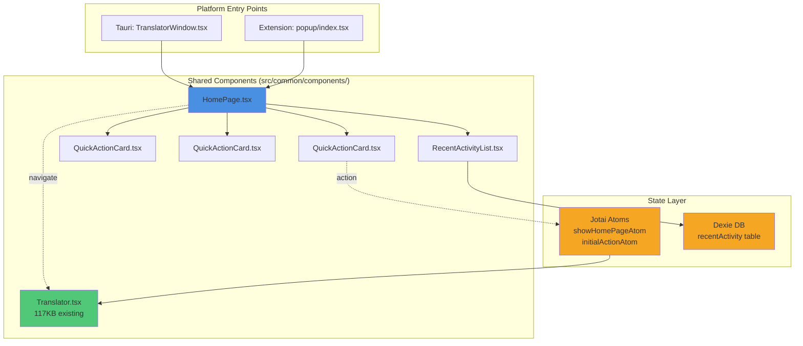

# Design Specification: Homepage Landing Interface

## Overview

nextai translator currently lacks a centralized entry point, with users immediately directed to translation functionality. This design introduces a homepage that serves as a welcoming landing interface, providing feature discovery, quick access shortcuts, and navigation to core functionality across both desktop and browser extension platforms.

## Recommended Approach

Create a new shared `HomePage` component in `src/common/components/` that provides a card-based layout with quick actions for translate/polish/summarize, recent activity display, and navigation to settings/vocabulary. Integrate this as the default view in both Tauri desktop app and browser extension popup, with optional user preference to bypass and default to translator.

## Key Technical Decisions

### 1. Component Architecture
- **Options Considered**:
  - Single monolithic HomePage component vs. modular sub-components
  - New routing layer vs. conditional rendering within existing entry points
- **Tradeoffs**:
  - Monolithic: Simpler integration but harder to maintain
  - Modular: Better separation of concerns, reusable cards, testable in isolation
  - Routing: More complexity but cleaner state management
  - Conditional: Minimal changes but mixing concerns
- **Recommendation**: Modular component architecture with conditional rendering - create `HomePage.tsx`, `QuickActionCard.tsx`, and `RecentActivityList.tsx` in `src/common/components/`. Use Jotai atom for homepage visibility state rather than adding routing overhead. This balances maintainability with minimal architectural changes.

### 2. State Management
- **Options Considered**:
  - Zustand global store vs. Jotai atoms vs. React Context vs. localStorage only
- **Tradeoffs**:
  - Zustand: Good for cross-component state but adds to global store size
  - Jotai: Atomic updates, perfect for isolated feature state
  - Context: Simple but re-renders all consumers
  - localStorage: No reactivity without additional hooks
- **Recommendation**: Jotai atoms for UI state (`showHomePageAtom`, `recentActivityVisibleAtom`) with Dexie for recent activity persistence. This follows existing patterns (e.g., `showSettingsAtom`) and provides optimal re-render performance for homepage-specific state.

### 3. Recent Activity Storage
- **Options Considered**:
  - Dexie (IndexedDB) vs. localStorage vs. platform-specific storage
- **Tradeoffs**:
  - Dexie: Already used, supports complex queries, large datasets; slightly heavier
  - localStorage: Simple, synchronous; limited to 5-10MB, no indexing
  - Platform storage: Native but requires platform-specific code
- **Recommendation**: Dexie with new `recentActivity` table (schema: id, type, sourceText, targetText, sourceLang, targetLang, timestamp). Leverage existing Dexie setup and `useLiveQuery` for reactive updates. Store max 50 items with automatic FIFO cleanup.

### 4. Platform Integration
- **Options Considered**:
  - Separate implementations per platform vs. shared component with platform wrappers
- **Tradeoffs**:
  - Separate: Maximum flexibility but duplicated code and maintenance burden
  - Shared: Code reuse, consistency; requires platform abstraction
- **Recommendation**: Shared `HomePage` component with platform-specific wrapper props. Desktop: Add state to `TranslatorWindow.tsx` to toggle between HomePage and Translator. Extension: Wrap in `popup/index.tsx` with conditional render. Use `isDesktopApp` utility for platform-specific styling (e.g., window drag region on Tauri).

### 5. Quick Action Interaction
- **Options Considered**:
  - Inline input on homepage vs. navigate to Translator component vs. modal overlay
- **Tradeoffs**:
  - Inline: Users stay on homepage but duplicates Translator UI
  - Navigate: Clean separation, reuses existing Translator; extra navigation step
  - Modal: Good UX but adds complexity
- **Recommendation**: Navigate to Translator component with pre-filled context. Set Jotai atom `showHomePageAtom` to false and pass quick action type via new `initialActionAtom`. This reuses 117KB Translator component without duplication, maintaining single source of truth for translation logic.

### 6. Styling Approach
- **Options Considered**:
  - BaseUI Card components vs. custom styled divs vs. JSS classes
- **Tradeoffs**:
  - BaseUI Card: Consistent with existing UI, accessible, themeable; less customization
  - Custom styled: Full control but reinventing wheel
  - JSS: Good for complex layouts but mixing paradigms
- **Recommendation**: BaseUI `Card` component with Styletron overrides for quick action cards. Use `useStyletron()` hook for responsive layout grid. This maintains consistency with Settings.tsx and Translator.tsx while keeping styling simple and theme-aware.

## High-Level Architecture



## Component Specifications

### HomePage.tsx
**Responsibilities**: Layout orchestration, navigation logic
**Props**: `engine: Styletron`, `onNavigateToTranslator: (actionType) => void`
**State**: Subscribe to `showHomePageAtom`, theme via `useTheme()`
**Layout**:
- Header with logo and app title (reuse `LogoWithText` component)
- Grid of 3 quick action cards (translate, polish, summarize)
- Recent activity section (conditional on settings)
- Footer with settings/vocabulary navigation links
**Size Estimate**: ~300 lines

### QuickActionCard.tsx
**Responsibilities**: Display feature card with icon, title, description, CTA button
**Props**: `title: string`, `description: string`, `icon: IconType`, `actionType: TranslateMode`, `onClick: () => void`
**Styling**: BaseUI Card with hover effects, icon from react-icons
**Size Estimate**: ~80 lines

### RecentActivityList.tsx
**Responsibilities**: Fetch and display recent translations
**Data Source**: `useLiveQuery(() => db.recentActivity.orderBy('timestamp').reverse().limit(5).toArray())`
**Features**: Click to reload translation, clear history button
**Empty State**: Friendly message encouraging first translation
**Size Estimate**: ~150 lines

## Database Schema Extension

```typescript
// Add to src/common/internal-services/db.ts
interface RecentActivity {
    id?: number
    type: 'translate' | 'polish' | 'summarize'
    sourceText: string
    targetText: string
    sourceLang: LangCode
    targetLang: LangCode
    timestamp: number
}

// Dexie schema update
recentActivity: '++id, timestamp, type'
```

## State Atoms

```typescript
// src/common/store/homepage.ts (new file)
import { atom } from 'jotai'
import { TranslateMode } from '../translate'

export const showHomePageAtom = atom<boolean>(true)
export const initialActionAtom = atom<TranslateMode | null>(null)
export const recentActivityVisibleAtom = atom<boolean>(true)
```

## Integration Points

### Tauri Desktop (src/tauri/windows/TranslatorWindow.tsx)
```typescript
// Add state
const [showHomePage] = useAtom(showHomePageAtom)

// Conditional render
return (
    <Window>
        {showHomePage ? (
            <HomePage engine={engine} />
        ) : (
            <Translator {...existingProps} />
        )}
    </Window>
)
```

### Browser Extension (src/browser-extension/popup/index.tsx)
```typescript
// Similar conditional render pattern
const [showHomePage] = useAtom(showHomePageAtom)

return showHomePage ? (
    <HomePage engine={engine} />
) : (
    <Translator {...existingProps} />
)
```

## Key Considerations

### Performance
- Lazy load RecentActivityList (React.lazy + Suspense) to prevent blocking homepage render
- Limit recent activity query to 5 items initially, load more on expansion
- Memoize QuickActionCard to prevent re-renders on parent state changes
- Target: <300ms homepage initial render, <100ms navigation to Translator

### Security
- Sanitize recent activity text display (prevent XSS if user translates malicious content)
- Use React's built-in escaping for text rendering
- No eval or dangerouslySetInnerHTML in homepage components

### Scalability
- Recent activity table with indexed timestamp for fast queries
- Automatic cleanup: Delete entries older than 30 days or when count exceeds 50
- Consider pagination if showing "view all" history feature in future

### Accessibility
- Keyboard navigation: Tab through quick action cards, Enter to activate
- ARIA labels on all interactive elements
- Focus management: Auto-focus first quick action card on homepage mount
- Screen reader announcements for navigation state changes

## Success Criteria

1. **Functional**: All quick action cards navigate to Translator with correct pre-filled action type
2. **Performance**: Homepage loads in <300ms, no regression in Translator load time
3. **Consistency**: Identical behavior and appearance across Tauri and browser extension
4. **Persistence**: Recent activity survives app restart and displays correctly
5. **i18n**: All homepage text fully internationalized (add namespace: `homepage`)
6. **Responsive**: Layout adapts to window sizes 800x600 to 1920x1080 without breaking
7. **Regression-free**: Existing translator, settings, vocabulary functionality unaffected

## Implementation Phases

### Phase 1: Core Components (Priority: Must)
- Create HomePage.tsx with static layout
- Create QuickActionCard.tsx with navigation logic
- Set up Jotai atoms for state management

### Phase 2: Recent Activity (Priority: Should)
- Extend Dexie schema with recentActivity table
- Create RecentActivityList.tsx
- Hook translation completion to save activity

### Phase 3: Platform Integration (Priority: Must)
- Integrate into TranslatorWindow.tsx
- Integrate into popup/index.tsx
- Add user preference: "Show homepage on startup"

### Phase 4: Polish (Priority: Should)
- i18n for all homepage strings
- Animations for card hover/navigation
- Empty state illustrations
- Keyboard shortcuts (Ctrl+H for homepage toggle)

## Risks and Mitigations

**Risk**: Homepage adds friction to power users' workflows
**Mitigation**: Add setting "Default to translator" and keyboard shortcut (Ctrl+T) to bypass homepage instantly

**Risk**: State management complexity with multiple Jotai atoms
**Mitigation**: Keep atoms isolated to homepage feature, document in inline comments, follow existing `showSettingsAtom` pattern

**Risk**: Recent activity storage grows unbounded
**Mitigation**: Implement automatic cleanup in Dexie service layer, expose "Clear history" in UI

**Risk**: Different behavior across platforms despite shared component
**Mitigation**: Comprehensive E2E tests on both platforms, shared test suite for homepage features
